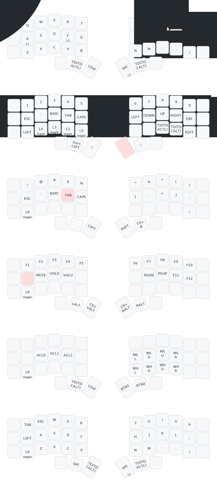

# Soundmonster's layout for Corne

This layout was first adapted from [Soundmonster's](https://github.com/soundmonster) layout for Corne keyboard. I made several changes here and there, and now it's a completely different beast. I removed nearly all features that Soundmonster has neatly included in the keymap to keep it minimal. Depicted below is the layers of my keymap. The image is generated using [caksoylar](https://github.com/caksoylar)'s [keymap drawer](https://github.com/caksoylar/keymap-drawer).

